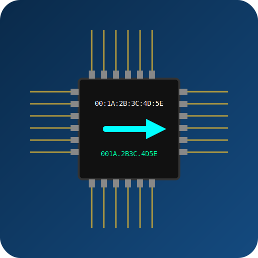

<div id="top"></div>

<!-- PROJECT SHIELDS -->

<!-- PROJECT LOGO -->

<p align="center">
  
</p>

<br />
<div align="center">

  <h3 align="center">maconvert</h3>

  <p align="center">
    maconvert is a tool to convert mac addresses from/to different formats.
  </p>
</div>

<!-- TABLE OF CONTENTS -->
<details>
  <summary>Table of Contents</summary>
  <ol>
    <li>
      <a href="#about-the-project">About The Project</a>
      <ul>
        <li><a href="#built-with">Built With</a></li>
      </ul>
    </li>
    <li>
      <a href="#Features">Features</a>
      <ul>
        <li><a href="#installation">Installation</a></li>
        <li><a href="#requirements">Requirements</a></li>
		<li><a href="#build">Build Instructions</a></li>
      </ul>
    </li>
    <li><a href="#usage">Usage</a></li>
    <li><a href="#contributing">Contributing</a></li>
	<li><a href="#license">License</a></li>
    <li><a href="#contact">Contact</a></li>
  </ol>
</details>

<!-- ABOUT THE PROJECT -->
## About The Project

To change between the different mac address formats, like cisco and posix, this tool is developed to assist.

<p align="right">(<a href="#top">back to top</a>)</p>

### Built With

* [Python3](https://www.python.org/)

<p align="right">(<a href="#top">back to top</a>)</p>

<!-- Features -->
## Features

- Automatically reads and validates a MAC address from the clipboard.
- Supports multiple MAC address formats
 - POSIX format: aa:bb:cc:dd:ee:ff
 - Windows NT format: AA-BB-CC-DD-EE-FF
 - Cisco format: aabb.ccdd.eeff

Simple GUI with buttons to copy the desired format to the clipboard.
Displays an error message if the clipboard does not contain a valid MAC address.

<p align="right">(<a href="#top">back to top</a>)</p>

<!-- Installation -->
### Installation

```bash

git clone https://github.com/skruszka/maconvert.git
```
<p align="right">(<a href="#top">back to top</a>)</p>

<!-- Requirements -->
## Requirements (Linux)

Python 3.x
wxPython
pyperclip

Install dependencies via pip:
```
pip install -r requirements.txt
```

## Requirements (Windows)

To build and run maconvert on Windows, make sure the following components are installed:

1. Operating System
- Windows 10 or later (64-bit)
- Administrator privileges for installation

2. Python
- Python 3.11.x (64-bit)
- Ensure pip is available in your PATH

3. Microsoft Visual C++ Redistributable
- Download VC++ Redistributable (x64): https://aka.ms/vs/17/release/vc_redist.x64.exe

<!-- Build -->
## Build Instructions (Windows)

Follow these steps to build the maconvert executable on Windows:

1. Clone the repository:
   git clone https://github.com/skruszka/maconvert.git
   cd maconvert

2. Install Python dependencies:
   pip install -r requirements.txt

3. Install PyInstaller:
   pip install pyinstaller

4. (Optional) Install Microsoft Visual C++ Redistributable if not already installed:
   Download from: https://aka.ms/vs/17/release/vc_redist.x64.exe

5. Build the executable:
   pyinstaller --onefile --noconsole maconvert.pyw

6. The executable will be available in the "dist" folder:
   dist/maconvert.exe

Optional:
- To include an application icon:
   pyinstaller --onefile --noconsole --icon=maconvert.ico maconvert.pyw

- To create a portable build without requiring VC++ installation:
   Add the required DLLs (MSVCP140.dll, VCRUNTIME140.dll) using the --add-binary option or by editing the .spec file.

- For an automated build you can use the maconvert_build_x64.ps1 file

<!-- USAGE EXAMPLES -->
## Usage
1. Copy a MAC address to your clipboard (e.g., AA:BB:CC:DD:EE:FF, aabb.ccdd.eeff, or aabbccddeeff), e.g. with <CTRL> + <C> .
2. Run the script:
```sh
python maconvert.pyw
```
Use a hotkey binding e.g. <CTRL> + <ALT> + <M> to start maconvert easy if it is needed

<!-- CONTRIBUTING -->
## Contributing

Contributions are what make the open source community such an amazing place to learn, inspire, and create. Any contributions you make are **greatly appreciated**.

If you have a suggestion that would make this better, please fork the repo and create a pull request. You can also simply open an issue with the tag "enhancement".

1. Fork the Project
2. Create your Feature Branch (`git checkout -b feature/AmazingFeature`)
3. Commit your Changes (`git commit -m 'Add some AmazingFeature'`)
4. Push to the Branch (`git push origin feature/AmazingFeature`)
5. Open a Pull Request

<p align="right">(<a href="#top">back to top</a>)</p>

<!-- License -->
## License

This project is licensed under the terms of the GNU General Public License v3.0.
See the LICENSE file for details.
You can also find the full text of the license at:
https://www.gnu.org/licenses/gpl-3.0.en.html

<p align="right">(<a href="#top">back to top</a>)</p>

<!-- CONTACT -->
## Contact

Sascha Kruszka - sascha@retiacula.de

<p align="right">(<a href="#top">back to top</a>)</p>
